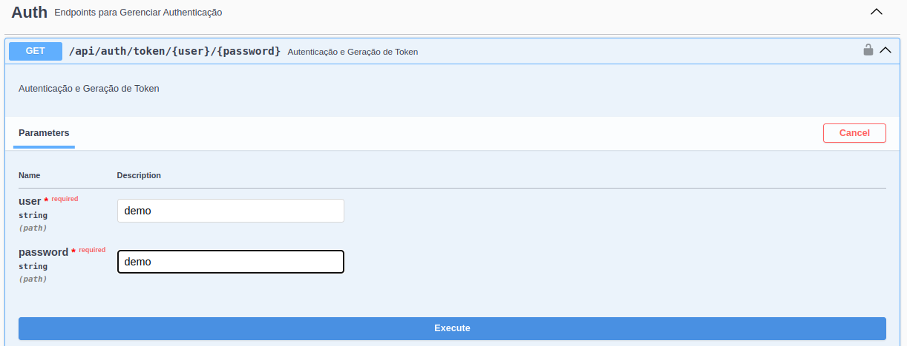
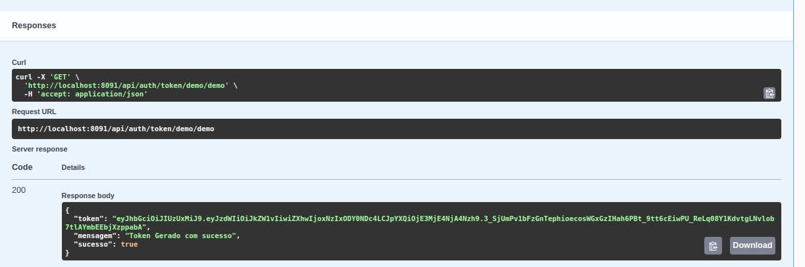
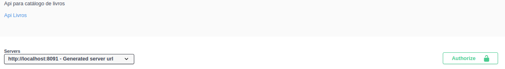
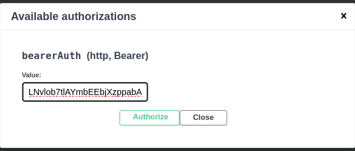
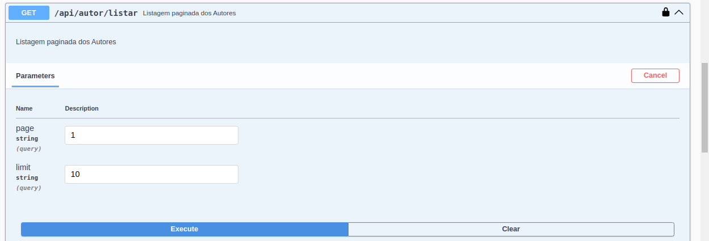
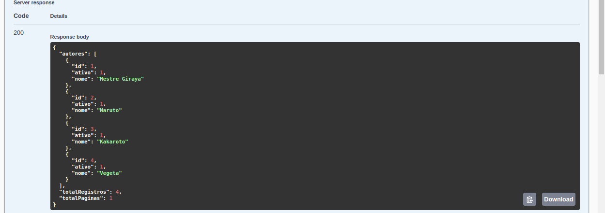

<h1><center>Desafio Técnico com Aplicações Spring</center></h1>

## Apresentação do Projeto
<p style="text-align: justify;">
O presente projeto consiste em um desafio técnico abordando 3 aplicações em Spring Boot. Até a presente data (22-07-2024) está sendo finalizado o projeto de Api Livros. As atividades nesses projetos foram iniciadas dia 19-07-2024 durante a noite.
</p>

<p style="text-align: justify;">
Foram planejadas e criadas atividades para concretizar a entrega do projeto Api Livros, tendo sido distribuídas em 4 Fases, sendo 4 Milestones. Cada fase foi controlada no quadro de atividades gratuito aqui no GitHub mesmo. É possível conferir a entrega das atividades no projeto abaixo:
</p>

https://github.com/users/devBino/projects/7/views/4

<p style="text-align: justify;">
Outro aspécto a ser mencionado, é que foram entregues em torno de 40 Story Points nesses últimos 3 dias. Geralmente girando em torno de 1 a 3 pontos, durante as 4 Fases de trabalho compreendidas desde a última sexta feira a noite.
</p>

<p style="text-align: justify;">
Também nos preocupamos com CI/CD configurando pipelines para validar cada nova feature vinda para branch develop, bem como a fase de deploy para VPS quando as atividades de cada Milestone foram empacotadas em releases e mergeadas na master.
O resultado disso, é que temos a aplicação rodando também em uma VPS mantida por processos 100% automáticos de CI e CD, se beneficiando de Docker para isso.
</p>

## Pipelines CI/CD
|Release | Status | Milestone |
|--------|--------|--------|
|Release/1.0.0| | [Fase 1](https://github.com/devBino/snow-spring-services/milestone/1)|
|Release/1.1.0| | [Fase 2](https://github.com/devBino/snow-spring-services/milestone/2)|
|Release/1.2.0| | [Fase 3](https://github.com/devBino/snow-spring-services/milestone/3)|
|Release/1.3.0| | [Fase 4](https://github.com/devBino/snow-spring-services/milestone/4)|
|Release/1.4.0| | [Fase 5](https://github.com/devBino/snow-spring-services/milestone/5)|
|Release/1.5.0| | [Fase 6](https://github.com/devBino/snow-spring-services/milestone/6)|
|Master| |[Fase 6](https://github.com/devBino/snow-spring-services/milestone/6)|

## Como rodar os projetos

#### 1 - Requisitos
- Git instalado
- Docker instalado
- Possuir conta no Docker Hub (Desejável)

#### 2 - Clone o repositório
<p style="text-align: justify;">
Em um terminal, navegue até o diretório de sua preferência e rode o seguinte comando:
</p>

```
git clone https://github.com/devBino/snow-spring-services.git
```

#### 3 - Acesse a pasta Raiz do repositório

<p style="text-align: justify;">
Para rodar a aplicação vamos usar docker compose, portanto acesse a raiz do repositório com comando abaixo:
</p>

```
cd snow-spring-services/
```

#### 4 - Realize login no seu docker hub
<p style="text-align: justify;">
Rode o comando abaixo para realizar login no docker hub. Nesse ponto será solicitado seu usuário docker e seu token no docker hub:
</p>

```
docker login
```

#### 5 - Rodando a Imagem Docker da Api Livros

<p style="text-align: justify;">
Ainda estando na pasta raiz vamos baixar a imagem do Docker Hub e já rodar ela com o seguinte comando:
</p>

```
docker compose -f docker-compose-run-develop.yml up -d
```

#### 6 - Levantando a stack manualmente localmente
<p style="text-align: justify;">
Você pode não ter uma conta no Docker Hub, então outra opção é subir a aplicação manualmente, mas ainda usando docker compose. A diferença é que localmente você vai precisar "buildar" manualmente a aplicação olhando para o código local na sua máquina, o mesmo processo feito automáticamente durante os pipelines que ciram as docker images e enviam para o docker hub antes de finalizar o deploy para VPS.
Então:
</p>

- Navegue da pasta raiz para dentro de **api-livros**
- Na pasta **api-livros** rode os comandos para realizar o build do projeto da api
```
mvn clean install -DskipTests && mvn clean package -DskipTests
```
- Volte para a pasta raiz do repositório
- Rode o comando abaixo
```
docker compose up -d --build
```

#### 7 - Acesse o endpoint GET ping

Acesse o endpoint <br/>
**http://localhost:8091/api/auth/ping**
<br/>
Esse endpoint não necessita de token, você deve obter uma resposta **pong** se a aplicação subiu corretamente.

#### 8 - Acesse a documentação da API

Agora que a aplicação subiu corretamente, você pode acessar a documentação da API e dar uma checada nos seus endpoints disponíveis.

No endpoint de autenticação, utilize as credenciais "demo" e "demo" nos path parans para obter um token de acesso.

http://localhost:8091/swagger-ui/index.html

##### 8.1 - Acesse o endpoint para obter o token 

Utilize as credenciais "demo" e "demo" como consta abaixo, depois clique em execute




##### 8.2 - Copie o token no response



##### 8.3 - Autorize todos os endpoints

Clique no "Cadeado Verde Authorize" e depois informe token





##### 8.4 - Faça uma listagem de autores

Para checar se funcionou, faça uma listagem de autores


